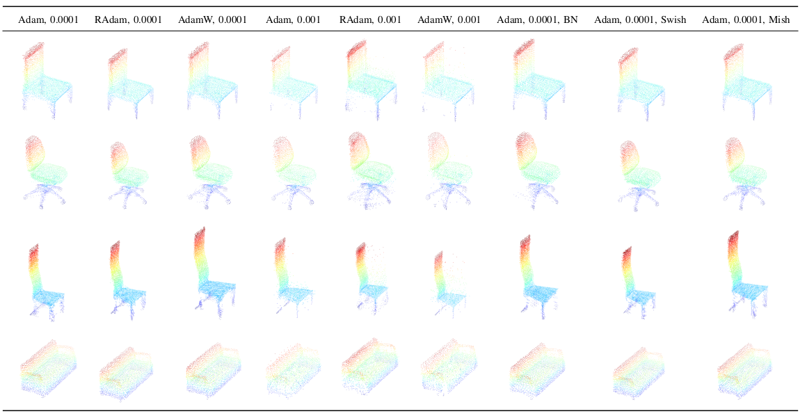

# VRCNet: Enhanced Point Cloud Completion

This repository contains the research and experimental outcomes for enhancing the VRCNet model, aimed at improving point cloud completion tasks for real-world scanned incomplete point clouds due to occlusion and noise.

## Introduction

VRCNet is a deep neural network designed to efficiently complete point clouds, which are often incomplete when obtained from real-world scans. My research focused on optimizing VRCNet's performance through various experiments, including the use of different optimizers, learning rates, and network modifications.

## Experiments Overview

I conducted a series of experiments to investigate the impact of:
- Different optimizers: Adam, RAdam, AdamW.
- Learning rates: 0.0001 and 0.001.
- Batch Normalization within the Linear Residual Block.
- Swish and Mish activation functions compared to ReLU.

## Purpose

The primary goal was to identify strategies that improve the network's ability to reconstruct detailed and accurate point clouds. By analyzing different approaches, I aimed to enhance the model's performance significantly over the baseline implementation.

## Qualitative Results

The following image showcases the visual outcomes of our experiments:

Each row in the image corresponds to the results of a unique experimental setup. The qualitative analysis demonstrates the effectiveness of each configuration in completing the point cloud, with improvements in coherence and detail that bring the results closer to the ground truth. The leftmost column with parameters Adam optimizer and learning rate 0.0001 is the baseline performance of the network. The best results are obtained when Batch Normalization(BN) is applied with Adam optimizer and 0.0001 learning rate. The approximate improvement in the performance is about 12.5%.

